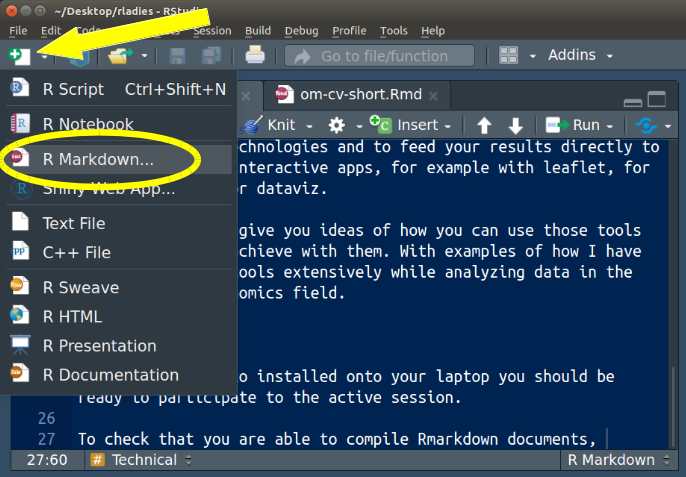
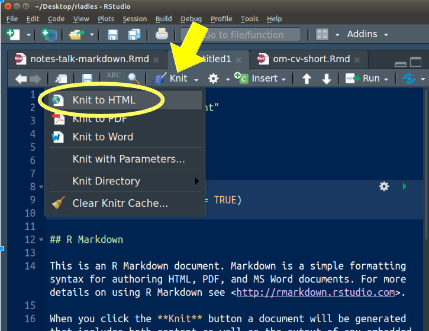

[R-Ladies Milan](https://www.meetup.com/R-Ladies-Milan/) workshop, May 9^th^, 2019.

## Abstract

In data science, we need to **communicate** our results and observations. We communicate our results to **our team**, to a **wider audience** or sometimes  just to **ourselves** (to remember what were doing in six months time).

If you work in R, you can communicate your results easily, because R is very well integrated with [**Markdown**](https://en.wikipedia.org/wiki/Markdown). This simplified markup language is a universal source to *.docx, .epub, .pdf* and, especially, *.html* files. Two packages, [**Rmarkdown**](https://bookdown.org/yihui/rmarkdown/) and [**knitr**](https://yihui.name/knitr/), literally knit together R code and markdown text.

These packages run your R code, style your text and show the results in a single output. In this way you can produce [elegant and reproducible reports](https://rmarkdown.rstudio.com/).

Since markdown is **native to HTML**, also its integration in R works best with html outputs (luckily today we communicate mostly online). R has a wide ecosystem of packages that you can use to integrate your data analysis into HTML products, such as [slides](https://revealjs.com/#/), [books](https://bookdown.org/) or a [blog](https://alison.rbind.io/post/up-and-running-with-blogdown/).

This opens a realm of possibilities to present your data analysis with web native technologies, to show your code and feed your results directly to static plots, but also to interactive apps, for example with [leaflet](https://rstudio.github.io/leaflet/) for maps or [d3](https://rstudio.github.io/r2d3/) for dataviz.

In this workshop I'll show of how you can use those tools and what you can achieve with them, with practical exercises and examples from my work in the field of biology and genomics.


# Technical

If you have Rstudio installed onto your laptop you should be ready to participate to the active session.

Open a new Rmarkdown file in Rstudio and knit it to be sure that you are able to compile Rmarkdown documents.

Open a markdown file:



Knit it:



You might have to install these packages:

```{r, eval = FALSE}
install.packages("rmarkdown")
install.packages("knitr")
```

## Other packages

You can install these additional/optional packages if during this workshop you want to try them out.

```{r, eval = FALSE}
install.packages("revealjs") # make HTML slides
install.packages("bookdown") # make HTML books
install.packages("blogdown") # make websites / blogs
install.packages("leaflet") # make maps on OpenStreetMaps
install.packages("r2d3") # interface to d3
```