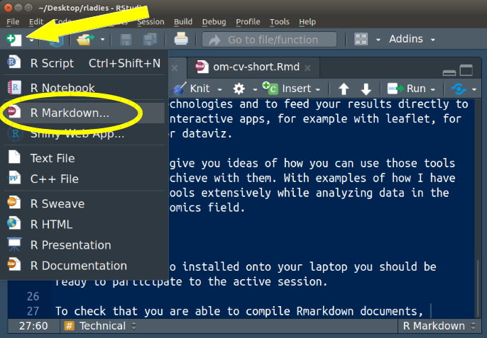
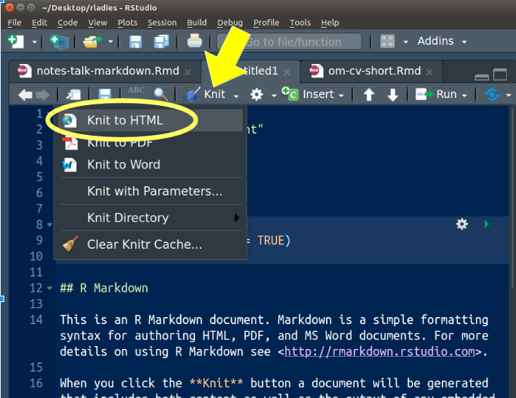

# Communicate your Results Elegantly with Rmarkdown

[R-Ladies Milan](https://www.meetup.com/R-Ladies-Milan/) workshop, May 9th, 2019. [Register here](https://www.meetup.com/rladies-milan/events/260831732/)

:point_up::star:**Download this github repo on your laptop**, because in the practical session we will work on the files in the `examples` subfolder.

## Abstract

In data science, we need to **communicate** our results and observations. R has powerful tools for communication, such as [**Rmarkdown** and **knitr**](https://rmarkdown.rstudio.com/).

In this workshop we will learn how to use those packages to knit together text and R code and create beautiful and reproducible *reports*, *slides* and [*web pages*](https://bookdown.org/yihui/blogdown/).

While working on plant science, I've been using these tools when I had to communicate to my team both results and methodology. 

In this workshop I'll bring both examples from my work and simple code snippets that you can try to run on your computer.

Level: beginner

## Practical session

**Download this github repo on your laptop**, because we will use the scripts in the `examples` folder.

If you have Rstudio installed onto your laptop you should be ready to knit rmarkdown files to HTML and docx.

Open a new Rmarkdown file in Rstudio and knit it to be sure that you are able to compile Rmarkdown documents.

Open a markdown file:



Knit it:



You might have to install these packages:

```r
install.packages("rmarkdown")
install.packages("knitr")
```

### Other packages

You can install these additional/optional packages if during this workshop you want to try them out.

```r
install.packages("revealjs") # make HTML slides
install.packages("bookdown") # make HTML books
install.packages("blogdown") # make websites / blogs
install.packages("leaflet") # make maps on OpenStreetMaps
install.packages("r2d3") # interface to d3
```

## About me

I've learned R during my PhD in biology at the University of Milan. At that time, I was producing extensive datasets in my research, and I wanted to be able to analyze them autonomously.

Later, R has been fundamental in my two postdocs, where I used it on a daily basis to explore and model genomic data. First at HHU/CEPLAS, in Duesseldorf, where I used it to find targets to improve photosynthesis in crops, later at IRD, in Montpellier, where I used it to explore the genetics of Asian and African rice.